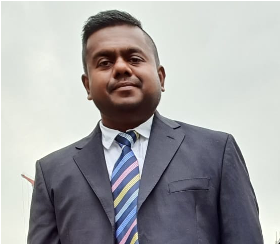

# Team

    
**Chief Executive Officer - Liu Song**

Liu Song started his career with China Resources in their Shipping Department. He later moved to establish his own shipping company to own and operate various types of vessels including bulk carriers, gas carriers and some specialized vessels. His business acumen and in-depth knowledge in shipping is the guiding light  for Integrated Maritime. He is the CEO and major share holder of the company.  

#

    
**Chief Operating Officer - Paul Varghese**

  
Paul sailed on board various types of vessels with Pacific International Lines, Fleet Management and Synergy Maritime up to the rank of Chief Engineer. He joined ashore with Fleet Management in 2009 rising up to Fleet Manager. Paul has extensive experience in new building, dry docking, major repairs, commercial management and special projects. He joined Noble Group in 2017 to establish their Ship Management Division followed by Integrated Maritime in 2019 as one of the founders and COO. He has a collective industry experience of 19 years.

#

    
**Director, Marine - Capt. Ajay Kumar Das**

Ajay has sailed on dry bulk, tankers and container vessels during his sea career with Anglo Eastern Ship Mgmt until 2001. He joined ashore with PacMarine in 2002 as their vetting consultant before joining V Ships in Cyprus in 2005 as their Marine Supdt. He later moved to Stealth Gas as their Fleet Marine Manager in 2007. He joined Heidmar as their commercial operations Manager in 2010 followed by BP Shipping in their vetting and clearance division. He was heading the marine division of Pacific Gas in Singapore before joining IMM as the Director of Marine. Capt Ajay has 31 years of experience in the maritime industry.

# 

    
**Director, Technical APAC - Wang Yue Xian**

Wang started his sea career with Cosco Shipping in 1989 . He sailed on board various types vessels including oil, chemical, gas carriers, dry cargo vessels such as containers, bulk carriers etc. Wang came ashore with China LNG in 2007 as Tech Supdt to manage their LNG carriers. He later moved to Farenco Shipping to manage their Bulk Carriers and LNG vessels. He was the Technical Director and General Manager of LNG division with Farenco. With an aggregate experience of 30 years on board and ashore, Wang is the Technical Director of Integrated Maritime. 

# 

    
**Director, IT - Andrew Chan**

Andrew is an IT veteran with experience in multiple disciplines of IT arena. Following his graduation from University of North Carolina, he worked with various IT companies in the US including fleet management, networking, wireless technology, Big Data analytics, customised ERP developments, Internet based technology platforms etc. He along with his team of IT professionals work on Integrated Maritime’s own IT platform to cater to the growing need of Maritime Environment. Andrew is currently positioned as our Director of IT.
