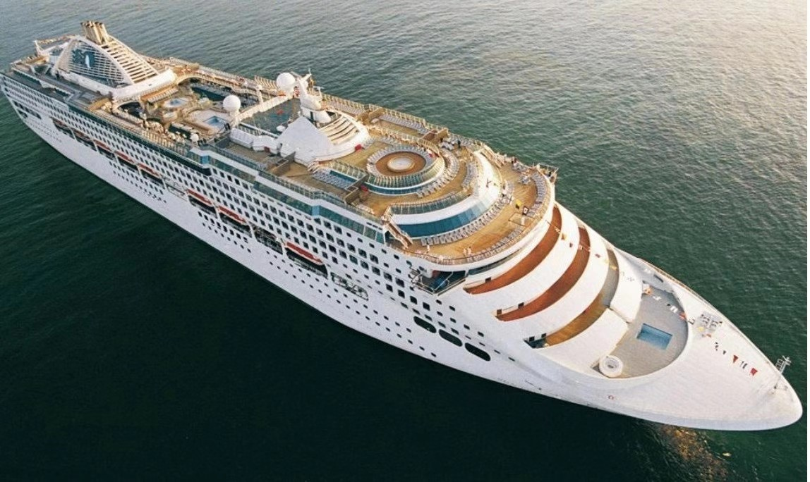

# 关于我们

Integrated Maritime Management (IMM) 是由一群来自航运行业经验丰富的人士建立，为全球客户提供全面综合的海事服务。公司于2019年成立，总部战略性地设于新加坡，并在全球关键地点设有分支机构。凭借我们的集体经验、知识和热情，我们以最合理的成本提供航运和船舶管理的所有服务领域。无论船舶和船员的大小、类型、建造和国籍，我们都能提供超出客户期望的全套解决方案

## 我们的愿景: 
成为我们客户最为信任的合作伙伴，提供最优秀的全方位综合海事服务
## 我们的使命:
随时随地提供以我们核心价值观为主导力的全方位海事管理服务 
## 核心价值观:
1. **安全** – 安全是我们的首要任务和保证
2. **卓越** – 超越我们对客户和行业股东的承诺，让我们所做的一切都与众不同
3. **诚信** – 我们的服务具有最高的诚信度和透明度
4. **创新** – 我们以不断创新为荣，利用最新的技术提高我们工作的准确性和效率
5. **环境保护** – 我们竭尽所能的降低所有工作对自然环境的影响，并承诺保护和维持自然本色
6. **团队合作** – 我们坚信团队的力量， 合作共赢才是成功的秘诀 
7. **客户优先** – 我们通过提供量身定制的解决方案，尽全力满足客户的要求