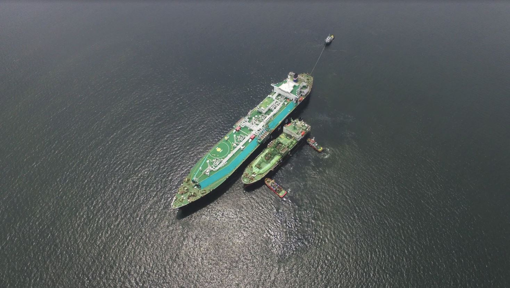
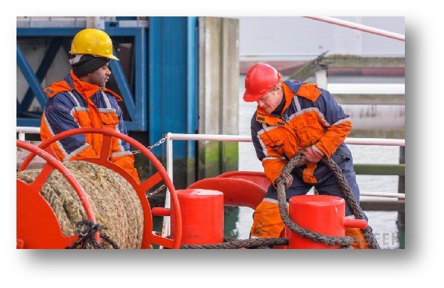
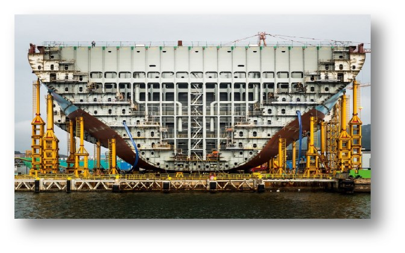
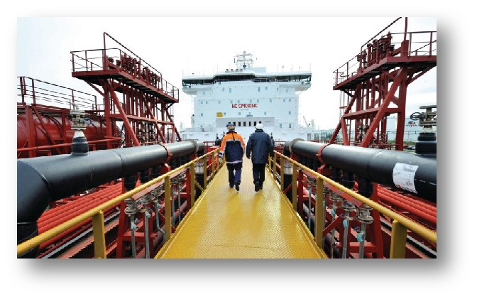

# 服务
## 技术管理  

我们成功完成东南亚首次 LNG 船对船操作

凭借我们海事团队超过100年的集体经验，我们可以以极具成本效益的方式为任何类型的船只提供最好的技术管理服务。我们与业界巨头和供应商的良好关系使我们能够为客户提供最佳报价。
技术管理方面，我们严格按照国际安全管理（ISM）规范和其他适用法规进行日常技术操作。IMM 是经劳氏船级社注册认证以履行其 ISM 相关职责的。IMM 技术管理下的所有船舶均由海事和技术部的专业人员悉心管理。
技术团队及其主管负责船舶操作技术方面的管理，安排定期的备件及技术服务需求，并不时为船上团队提供必要的指导和咨询。
海事部由主管、经理、总管和助理组成。他们负责货物业务、ISM相关职能以及所管理的船只。该团队在提供有关货物海运方面的建议和指导意见上拥有专业知识，无论是常规的货物的还是复杂的货物。 此外，海事部还负责有关船员管理方面的事宜。
IMM 使用世界一流的基于云计算的船队管理系统，用于计划维护、信息管理、船舶监控、记录保存、采购流程和财务功能。通过个性化的在线身份验证，所有客户都能安全地访问系统。
为确保向全球客户提供一流的、完全集成的服务，我们采取了将年轻和经验丰富的人才融合一处的独特配置。公司定期审核和绩效衡量，以领先于竞争对手，并确保我们的交付超过客户的预期

## 船员管理

称职的船员是有效管理船舶的关键。IMM 拥有充足的资源，可为各类船只提供合格、经验丰富且积极进取的各级船员。我们可以供应印度，菲律宾，中国和其他在世界各地的优秀船员。我们理解船员对船舶运营成功的重要性。在 IMM，我们把船员视为公司的品牌大使。每一位都由我们的人事部门定期精心挑选、培训、评估和监督。我们处于全球战略位置的办事处为全球海员的招聘和培训提供了便利。
公司还为船上的所有船员提供广泛的福利，这一政策使我们有别于其他同行，因此公司会经常评审，回顾和提升这一政策的实施。 

## 新造船和项目管理

IMM 及其专业团队能够为客户提供概念设计、详细工程、联系谈判、计划审批、现场监督、转换、船务评估和项目管理等支持。我们的顾问船艇建筑师和经验丰富的现场团队在我们强大的技术团队支持下，能够胜任所有这些活动。
特别需要注意的是，船舶的商业价值在很大程度上取决于允载货物的类型、即将颁布的法规、施工质量、建筑规格等。我们的团队凭借丰富的经验、知识和前瞻性，在这方面增加了巨大的价值。

## 质量管理

一艘船舶及其船员的状况对其被商业经营者顺利接管有着巨大的影响。这些船舶的状况通常会以同行和公认的行业标准为基准。因此，这些船只在检查期间保持良好状况，并达到可接受的评估标准是最重要的。
我们合格和经验丰富的团队可以提供以下船舶评估服务，以确保其随时处于最佳状态。
-预审检查
-船员培训
-基准测试船舶和操作标准的审计
-为客户/商业特定程序做准备

## 资产生命周期支持 

当船舶及其运作被委托给第三方时，对类似船只和类型不时进行检查和基准比对是非常重要的。船舶的商业价值在很大程度上取决于其状况、审查记录和管理质量。
IMM 可以代表船东进行和支持此类定期检查，并提供以下必要的生命周期支持：
- 购买前检查
- 状态检查
- 财务检查之前、之后
- 报废航程评估
- P&I 检查
- 船旗国检验
- 起租、停租调查
  
我们及时和高质量的报告图文并茂的提供准确，属实和与客户相关的信息。

## 闲置管理

我们的团队可以以正常成本在全球关键地点提供闲置服务。由于我们完善的程序和维修制度，船舶在搁置期间被很好的看护。
由于航运业的性质，让一些船舶暂时退出服务极具商业意义。在搁置过程中，适当保管、维护、监控以及定期向客户报告是让客户满意的关键