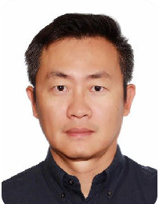
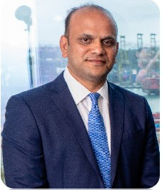
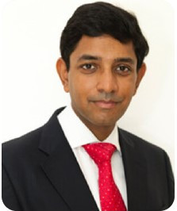
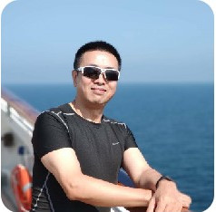

# Team

    
**首席执行官 柳松**

柳松先生毕业于上海海运学院，清华五道口GFD。有20余年的国内国际航运经验，在国际贸易业务的经营管理上亦有丰富的经验。与多家国际知名公司保持长期伙伴关系。是中国民营LNG海运领域的开拓者。  

#

    
**首席运营官 Paul Varghese**

Paul先生曾在Fleet Management和Synergy Maritime公司旗下的各类的船舶上任职，主要航行于太平洋国际航线，曾积功至大管轮职位。他在2009年加入Fleet管理公司，晋升为船队经理。Paul先生在新造船、坞修、大修、商业管理和特殊项目方面有丰富的经验。他于2017年加入Noble Group，成立了自己的船舶管理部门，并于2019年作为创始人和首席运营官加入了Integrated Maritime。带来了19年的行业经验。

#

    
**海务总监 Capt. Rachit Jain**

在Exon Mobil、BP和Bergshav船舶管理公司的海上生涯中，Rachit船长曾多次航行过干散货船、油轮和集装箱船。2007年，他加入了Exon Mobil在伦敦的分公司，并在离开之前担任质量保证和事故调查顾问。2012年，他进入OSM油轮管理部门，担任油轮管理主管。2013年，他创立了屡获殊荣的咨询公司——Safe Lane咨询有限公司。他主管公司所有与海事有关的活动。Rachit船长在航运业有23年的经验。 

# 

    
**技术总监 王跃先**

王跃先先生毕业于大连海运学院，有18年的船员经验，以及10余年的船舶管理经验。精通散货船、集装箱船、油轮、化学品船，高速客轮以及LNG船的安全及技术管理。是目前中国为数不多的既有柴油机管理经验，又有汽轮机管理经验的专业人士。​

王跃先先生是中国自主建造的第一艘大鹏昊轮和第三艘闽榕轮14.7万立方LNG船的技术总管。做为中国LNG船技术管理的先驱者之一,引领并全面指导了两家中国船厂完成了LNG船的坞修工程，取得了中国LNG修船史上具有里程碑意义的成功。 

# 

    
**IT总监 Andrew Chan**

Andrew Chan（陈安）先生，美籍华人，美国硅谷圣何塞大学MBA硕士。在IT领域有着深厚的管理和实施经验。在国内外曾多次从无到有的组建带领过综合技术团队完成各种开发运维项目。其中有大到上万台服务器的运维工作，也有小到几百台互联网B2B的开发项目。每次均能高效率，低成本的圆满完成。对新兴科技有着本能的冲动和渴望，遇到问题有独到的见解和解决能力。享受以高科技手段提升我们所有人生活品质的过程。

